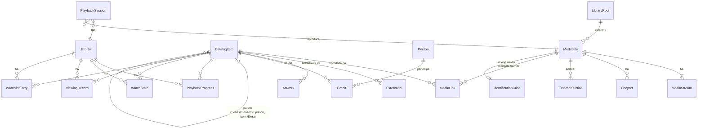

# 01 — Domain Model (Video Service)

- **Stato:** Approvato (2026-09-30)
- **Deriva da:** [Requisiti v0.1](../requirements/0001-video-service-requirements-v0.1.md) §3, §4, §6, §10–15, §17
- **Non definisce:** tecnologia, schema DB, API. Descrive concetti, relazioni e invarianti.

---

## 1. Principio guida: tre mondi separati

Il modello separa nettamente tre domini che cambiano per ragioni diverse:

```text
┌──────────────────────┐   ┌──────────────────────┐   ┌──────────────────────┐
│      CATALOGO        │   │        MEDIA         │   │       PROFILI        │
│  "cosa è"            │◄──┤  "dove sta, com'è    │   │  "chi guarda, cosa   │
│  Movie, Series,      │   │   fatto"             │   │   ha visto"          │
│  Episode, Extra,     │   │  MediaFile, Stream,  │   │  Profile, Progress,  │
│  metadata, artwork   │   │  Chapter             │   │  History, Watchlist  │
└──────────────────────┘   └──────────────────────┘   └──────────────────────┘
          ▲                                                      │
          └──────────── stato di visione riferito al catalogo ───┘
```

- **Catalogo**: identità editoriale del contenuto. Esiste indipendentemente dai file (un film resta nel catalogo anche se il disco è scollegato).
- **Media**: fatti tecnici osservati sul file. Il Video Service **non ne è proprietario** (§3): li legge, non li modifica.
- **Profili**: stato di fruizione per persona, riferito al catalogo, non ai file.

Il collegamento Catalogo ↔ Media è esplicito (`MediaLink`) perché è proprio ciò che l'ingest automatico propone e la correzione manuale modifica (§11, §13).

---

## 2. Diagramma



---

## 3. Catalogo

### 3.1 CatalogItem

Entità unica con un **tipo strutturale** (`kind`). Non esiste l'assunzione "ogni Video è un Movie" (§10).

| kind | Riproducibile | Parent | Note |
|---|---|---|---|
| `movie` | sì | — | Opera singola autonoma (film o documentario, vedi §3.2) |
| `series` | no (contenitore) | — | |
| `season` | no (contenitore) | `series` | `seasonNumber`; stagione 0 = speciali |
| `episode` | sì | `season` | `episodeNumber`; ordine di messa in onda |
| `extra` | sì | qualunque item, **opzionale** | `extraType`: trailer, featurette, behind-the-scenes, deleted-scene, interview, other |

Attributi comuni (metadata descrittivi, §12): titolo, titolo originale, titolo di ordinamento, anno / data di uscita, descrizione, generi, durata nominale, classificazione per età, lingua originale.

Identità interna: ID stabile generato dal sistema, **mai** derivato da path o da ID di provider esterni.

### 3.2 Documentari — proposta

I documentari possono essere film singoli **o serie** (docuserie). Se `documentary` fosse un `kind`, una docuserie non avrebbe una struttura Season/Episode.

**Decisione (D1):** `kind` descrive la *struttura*; un attributo separato `category` ∈ {`film`, `documentary`, …} descrive la *natura editoriale*. La navigazione "Film / Serie / Documentari" (§16) diventa una query su `kind` + `category`.

### 3.3 Extra

- Un Extra può essere associato a un Movie, una Series, una Season o un Episode, oppure restare **orfano** (§10: "quando necessario").
- Un Extra è riproducibile e ha il proprio tracking di visione, come ogni item riproducibile.

### 3.4 Versioni dello stesso film (§17)

Theatrical cut, director's cut e simili sono **CatalogItem distinti**. Il modello Work → Edition → Version non viene introdotto. Un attributo testuale libero `editionLabel` (es. "Director's Cut") permette di distinguerli nella UI senza impegnarsi su un modello futuro.

### 3.5 Metadata: provenienza e correzione

Requisito: un'identificazione automatica non diventa mai immutabile e una correzione manuale non deve essere persa (§13).

- **ExternalId** (`provider`, `id`): 0..n per item. Collega l'item a uno o più database esterni. Serve per il refresh e **non** è l'identità dell'item.
- Ogni campo di metadata ha una **provenienza**: `provider:<nome>` oppure `manual`.
- Un campo modificato manualmente diventa **locked**: i refresh automatici non lo sovrascrivono.
- Tutti i metadata e l'artwork sono **copiati localmente** (§12): la libreria funziona anche con il provider irraggiungibile.

### 3.6 Artwork

`Artwork` (item, `type` ∈ {poster, backdrop, logo, still, thumbnail}, lingua, sorgente ∈ {provider, upload manuale, generato dal video}, riferimento al file locale, `selected`). Per ogni tipo è selezionato al massimo un artwork. Gli altri restano come alternative (§13: "sostituire poster e artwork").

### 3.7 Persone e crediti

`Person` (nome, ExternalId, foto) e `Credit` (item, persona, ruolo ∈ {actor, director, writer, producer, …}, personaggio, ordine). Servono a cast e regista (§12) e alla futura navigazione per persona.

---

## 4. Media

### 4.1 LibraryRoot

Una radice di storage montata nel servizio (es. `/media/movies`). Attributi: percorso di mount, **hint** sul contenuto atteso (movies / series / mixed) usato dall'identificazione, stato (online/offline).

**Invariante di portabilità (§3, §18):** i `MediaFile` memorizzano il percorso **relativo alla LibraryRoot**. Passare da una cartella dell'host a un NAS significa cambiare il mount della root, non riscrivere i dati.

### 4.2 MediaFile

Un file fisico osservato. Attributi:

- percorso relativo, dimensione, mtime;
- **fingerprint** (es. dimensione + hash parziale) per riconoscere un file spostato o rinominato senza perdere collegamenti e progress;
- container, durata, bitrate complessivo;
- stato di ciclo di vita (vedi §6.1).

### 4.3 MediaStream

Ogni traccia del file. **Nessuna assunzione "1 video = 1 audio"** (§6): un file ha N tracce di ogni tipo.

Comuni: indice nel container, tipo (`video` / `audio` / `subtitle` / `attachment`), codec, lingua, titolo della traccia, flag `default` / `forced`.

| Tipo | Attributi specifici (necessari alla decisione di playback, §5) |
|---|---|
| video | risoluzione, frame rate, bit depth, profilo/livello del codec, **formato HDR** (SDR, HDR10, HDR10+, HLG, Dolby Vision con profilo e compatibilità del base layer), bitrate |
| audio | canali, channel layout, sample rate, bitrate, **lossless** (sì/no), estensioni a oggetti (Atmos, DTS:X) quando rilevabili |
| subtitle | **testuale vs immagine** (SRT/ASS vs PGS/VobSub), forced, SDH/non udenti |

Il formato HDR e il tipo di sottotitolo contano più di quanto sembri: determinano se un client può fare Direct Play o se servono remux/transcode/burn-in.

### 4.4 ExternalSubtitle

Sottotitoli in file sidecar accanto al MediaFile (es. `Film.it.forced.srt`). Vengono esposti al player come tracce aggiuntive, indistinguibili da quelle embedded.

### 4.5 Chapter

Capitoli del container (titolo, inizio, fine). Sono gratuiti da estrarre e utili per la navigazione. In futuro abilitano "salta intro".

---

## 5. Collegamento Catalogo ↔ Media e identificazione

### 5.1 MediaLink

Associa un `MediaFile` a un `CatalogItem` riproducibile.

- Attributi: `origin` ∈ {`auto`, `manual`}, confidenza (per `auto`), data di creazione.
- Un link `manual` **prevale sempre** e non viene toccato dalle ri-scansioni o dal re-matching.
- **Multi-episodio:** un singolo file può coprire più episodi (`S01E01-E02`), quindi un MediaFile può avere più MediaLink.
- **Più file per lo stesso item:** ammessi dal modello, es. la stessa edizione in 1080p e in 4K (D2).

### 5.2 IdentificationCase

La coda "Da verificare / Unmatched Media" (§13) è una vista sui MediaFile con un caso aperto.

- Attributi: file, stato ∈ {`pending`, `auto_matched`, `needs_review`, `resolved`, `ignored`}, **candidati** (riferimento al provider, punteggio, segnali usati: filename, cartella, metadata interni, provider).
- `needs_review` si attiva quando non c'è nessun candidato o quando i migliori sono troppo vicini tra loro (ambiguità).
- `ignored` copre i file da non catalogare (sample, file di prova…).
- Il resolver AI (§11, futuro) sarebbe solo un'ulteriore fonte di candidati. Il modello non cambia.

---

## 6. Ciclo di vita e invarianti del media

### 6.1 Stati del MediaFile

```text
discovered → analyzed → identified (linked)
                    └──→ needs_review ──(intervento manuale)──→ identified
identified ──(file scompare)──→ missing ──(ricompare / fingerprint)──→ identified
missing ──(oltre periodo di grazia, o rimozione esplicita)──→ removed
```

- **File scomparso ≠ contenuto cancellato.** Un disco scollegato o un NAS offline non deve cancellare catalogo, metadata, correzioni manuali o progress. L'item diventa "non disponibile".
- **File spostato o rinominato:** riconosciuto tramite fingerprint. Path aggiornato, link e stato preservati.
- **File sostituito** (nuovo remux dello stesso film): nuovo MediaFile. Se viene collegato allo stesso item, il progress resta valido (vedi §7.2).

---

## 7. Profili e tracking della visione

### 7.1 Profile

Nome, avatar e **preferenze di riproduzione**: lingue audio preferite (ordinate), lingue dei sottotitoli, modalità dei sottotitoli (off / solo forced / sempre). Servono per preselezionare le tracce quando esistono N tracce audio e sottotitoli.

**Profile ≠ Account (§14).** Nell'MVP esistono solo profili selezionabili senza autenticazione. Un futuro `Account` possiederà 1..n profili: si aggiunge una relazione, i profili non si ristrutturano.

### 7.2 Stato di fruizione (tutto per profilo, §15)

Tutto lo stato di visione si riferisce al **CatalogItem**, non al MediaFile: sostituire un file con un remux migliore non deve perdere la posizione.

| Entità | Contenuto | Requisito |
|---|---|---|
| `PlaybackProgress` | profilo, item, posizione, durata, file usato, **tracce selezionate** (audio/sub), aggiornato il | Progress, Resume |
| `WatchState` | profilo, item, visto sì/no, data, conteggio visioni. Impostabile anche **manualmente** ("segna come visto") | Watched state |
| `ViewingRecord` | profilo, item, inizio, fine, posizione massima raggiunta, completato sì/no | History |
| `WatchlistEntry` | profilo, item (film, serie o extra), aggiunto il | Watchlist (§14) |

**Concetti derivati (query, non entità):**
- **Continua a guardare** = item con progress oltre una soglia minima e sotto la soglia di completamento. Per le serie può includere il **prossimo episodio** (vedi D3).
- **Serie/stagione vista** = derivato dagli episodi.
- **Aggiunti di recente** = derivato dalla data di aggiunta al catalogo.

---

## 8. Sessione di riproduzione (runtime)

`PlaybackSession` è un'entità **transitoria** ma di primo livello, perché serve a limitare e gestire la concorrenza (MVP: 1 sessione; target: 3 eterogenee, §8).

Attributi: profilo, client/dispositivo, item e MediaFile, **modalità di delivery** ∈ {`direct_play`, `direct_stream`, `transcode`}, tracce selezionate, stato, inizio, ultimo heartbeat.

Le **capability del client** e la logica che sceglie la modalità sono dettagliate in `04-playback-architecture.md`. Qui basta che il modello preveda le tre modalità e più sessioni.

---

## 9. Invarianti riassuntive

1. L'identità dei CatalogItem è interna: non dipende da path, filename o ID di provider.
2. I path dei media sono relativi alla LibraryRoot.
3. Il Video Service non modifica mai i file media.
4. N tracce per tipo per file; formato HDR e tipo di sottotitolo sempre rilevati.
5. Le correzioni manuali (link, campi locked, artwork scelto) sopravvivono a ri-scansione e refresh.
6. Un file mancante non cancella catalogo, correzioni o stato di visione.
7. Lo stato di visione è per profilo e riferito all'item, non al file.
8. Nessuna assunzione di sessione singola.

---

## 10. Fuori scope (deliberato)

- Work → Edition → Version (§17): solo `editionLabel` testuale.
- Collezioni/saghe, tag utente, rating personali: aggiungibili dopo senza rompere il modello.
- Ordinamenti alternativi degli episodi (DVD order, absolute order): per ora solo l'ordine di messa in onda.
- Account e autenticazione: solo il punto di estensione.
- Musica: dominio separato (§2).

---

## 11. Decisioni prese in revisione

| ID | Domanda | Decisione |
|---|---|---|
| D1 | Documentario: `kind` o `category`? | `category` ortogonale al `kind` (§3.2) |
| D2 | Più file per lo stesso item (es. 1080p + 4K della stessa edizione)? | Ammesso dal modello; la scelta del file dipende dalle capability del client (playback architecture) |
| D3 | Soglia "visto" e "Continua a guardare" | Visto oltre il 90% della durata (o all'inizio dei titoli di coda, se noto). Continua a guardare tra il 2% e il 90%, più il prossimo episodio delle serie in corso |
| D4 | Progress riferito all'item o al file? | All'item (§7.2) |
